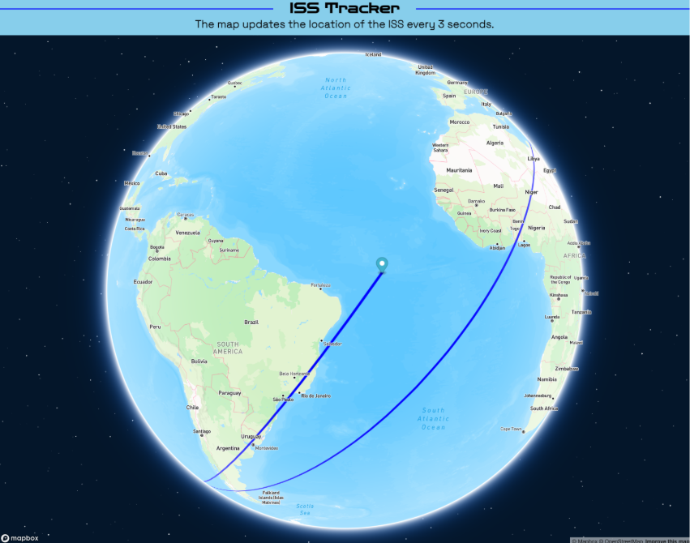

# ISS Tracker

## Description
A marker displays the position of the ISS on a Mapbox globe and tracks where it has been with a line. The location data is derived from [wheretheiss.at](https://api.wheretheiss.at/v1/satellites/25544). The location is updated every 3 seconds, leaving a line along the way as the marker moves around the world.

  

## Built With
- Vite
- Mapbox GL JS
- Native ES modules
- ESLint

## How To Run
Developed and tested with Node.js 24.
1. Clone the repository to your machine.
2. run `npm install`
3. Go to [mapbox.com](https://mapbox.com/), create an account, and get a token.
4. Create a .env file in the root directory, copy the contents of .env.example, paste them in the .env file, and replace 'your-access-token-here' with the Mapbox token.
5. run `npm run dev`

## Technical Highlight
**Antimeridian handling** — As the ISS crosses the 180° meridian, its longitude jumps from +180° to −180°. A naive line renderer would draw a line in the opposite direction, all the way around the globe to the other side of the meridian. To avoid this, the ground track is stored as a GeoJSON `MultiLineString`. When an antimeridian crossing is detected, the current line segment is capped with a point projected just past ±180° and a new line segment is started at that same location, so the path continues smoothly across the antimeridian instead of looping around the globe in the wrong direction.

## Future Improvements
1. Use an ISS icon instead of the default marker.
2. Display location data in the header.
3. Fetch the OMM (Orbit Mean-Elements Message) from [CelesTrak](https://celestrak.org) or [Space-Track](https://www.space-track.org) and use [satellite.js](https://www.npmjs.com/package/satellite.js) to generate lines for the past and future trajectories using SGP4 (Simplified General Perturbations 4).
4. Spread markers periodically throughout the lines indicating the date and time of the overpass.

## MIT License
Copyright (c) 2021 - 2026 Russell Propert

Permission is hereby granted, free of charge, to any person obtaining a copy
of this software and associated documentation files (the "Software"), to deal
in the Software without restriction, including without limitation the rights
to use, copy, modify, merge, publish, distribute, sublicense, and/or sell
copies of the Software, and to permit persons to whom the Software is
furnished to do so, subject to the following conditions:

The above copyright notice and this permission notice shall be included in all
copies or substantial portions of the Software.

THE SOFTWARE IS PROVIDED "AS IS", WITHOUT WARRANTY OF ANY KIND, EXPRESS OR
IMPLIED, INCLUDING BUT NOT LIMITED TO THE WARRANTIES OF MERCHANTABILITY,
FITNESS FOR A PARTICULAR PURPOSE AND NONINFRINGEMENT. IN NO EVENT SHALL THE
AUTHORS OR COPYRIGHT HOLDERS BE LIABLE FOR ANY CLAIM, DAMAGES OR OTHER
LIABILITY, WHETHER IN AN ACTION OF CONTRACT, TORT OR OTHERWISE, ARISING FROM,
OUT OF OR IN CONNECTION WITH THE SOFTWARE OR THE USE OR OTHER DEALINGS IN THE
SOFTWARE.
